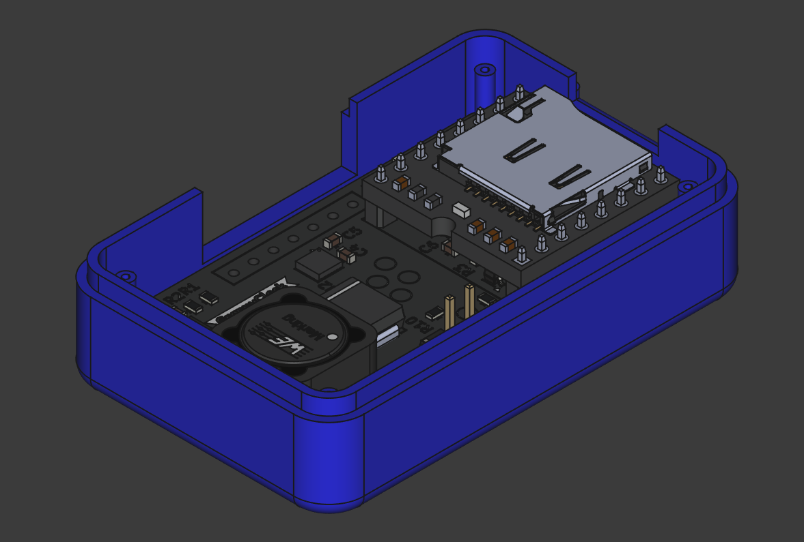

# GrannyClock Enclosure (v1.0)

## Overview

This folder contains the 3D design files for the GrannyClock enclosure, designed to house the GrannyClock PCB (a talking/chiming add-on module for the TFA Dostmann 60.3518.01 radio-controlled clock). The enclosure is designed using FreeCAD (v1.0+) and is intended for 3D printing.

## Features

- **Two-part design**: Bottom and top parts that screw together
- **Integrated battery holder**: Accommodates 2×AA batteries
- **Speaker mount**: Space for a small speaker
- **Access openings**:
  - Rectangular opening for clock module connection wires
  - SD card slot for easy access without disassembling the enclosure
- **Photoresistor protection**: Separate 3D printed part to protect the light sensor

## Design Notes

The enclosure design incorporates the 3D model of the PCB exported from KiCAD to ensure proper component placement and clearances. The design consists of three parts:

1. **Main Bottom Part**: Contains the PCB mount, battery holder, and connection points
2. **Top Cover**: Screws onto the bottom part to protect the electronics
3. **Photoresistor Guard**: A separate small part designed to protect the protruding photoresistor; needs to be glued to the main enclosure after printing

## Manufacturing

The enclosure is designed for 3D printing. While specific printing parameters are not established yet, the design will be optimized for common 3D printing techniques.

Recommended printing service: JLCPCB (the same provider used for PCB fabrication and assembly).

## Assembly Instructions

1. Print all three parts (bottom part, top cover, photoresistor guard)
2. Install the PCB in the bottom part using M2 screws for the mounting holes
3. Install the speaker in the designated space
4. Insert 2×AA batteries into the battery holder area
5. Glue the photoresistor guard to protect the light sensor
6. Secure the top cover to the bottom part using screws

👉 [Technical Drawing](ClockV1.pdf)

## Related Project Components

The GrannyClock is part of a larger project:

- [PCB Design](/PCB/ClockV1/): The electronic circuit board that fits inside this enclosure
- [Sniffer](/Sniffer/): Signal analysis tool used to reverse-engineer the TFA clock module
- Audio Files: MP3 samples for the hourly announcements

## License

This 3D design is licensed under the [Creative Commons CC0 1.0 Universal Public Domain Dedication](LICENSE).
