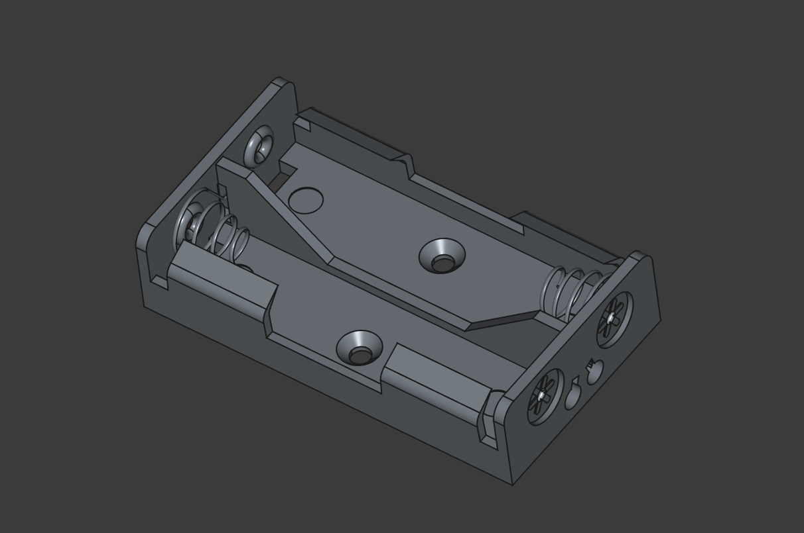

# AA Battery Holder for GrannyClock

## Overview

This is a modified version of the [AA Cell Battery Holder](https://grabcad.com/library/aa-cell-battery-holder-1/details) from GrabCAD. The original battery holder design has been modified to remove the wires to better fit the GrannyClock project requirements.

## Modifications

- Removed wires from the original design
- Re-export from FreeCAD

## License and Attribution

**Original Design:**
The original model is from GrabCAD, and according to GrabCAD's terms, users are granted:

> "a worldwide, non-exclusive, royalty-free, fully-paid, perpetual, irrevocable, non-sublicensable, non-assignable, and non-transferable license to use, reproduce, copy, modify, adapt, arrange, translate, and create derivative works of such User Submissions for such user's own benefit and non-commercial, internal use"

For full GrabCAD terms, refer to [GrabCAD Terms of Use](https://grabcad.com/terms).

Original Author: [Aiwen Aiwen](https://grabcad.com/aiwen.aiwen-2)
