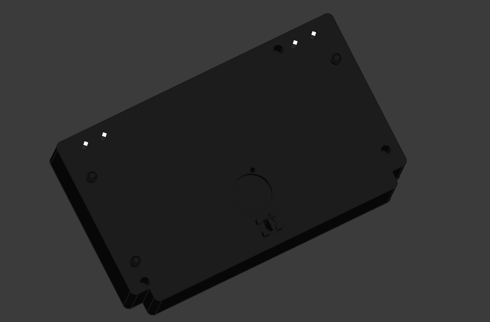

# HD-1688 Clock Movement Inner Mechanism Model

## Overview

This folder contains a 3D model of the inner clock mechanism found in the Sheng Bang HD-1688MRC radio-controlled clock movement. This particular mechanism is the heart of various radio-controlled clocks, including the TFA Dostmann 60.3518.01 (which is essentially a European market rebrand of the Sheng Bang product).

The model focuses on the outer dimensions and critical features necessary for PCB design and replacement purposes, rather than modeling the intricate internal cogs and mechanisms.

## Contents

- `HD-1688_Inner.FCStd` - FreeCAD source file
- `HD-1688_Inner.step` - STEP format export for CAD compatibility
- `HD-1688_Inner.csv` - Dimensions exported from FreeCAD Spreadsheet
- `HD-1688_Inner.png` - Visual reference of the 3D model

## Purpose

This model was created as part of a larger project to develop a musical/talking clock. The primary purpose of this specific model is to provide accurate dimensions for designing a replacement PCB that can interface with the mechanical clock movement.

The model includes:

- Accurate outer dimensions of the mechanism
- Protruding pins from the coils that must be soldered to the PCB
- Plastic alignment pins used for PCB positioning
- Screw hole locations for PCB mounting
- Photodiode holder dimensions
- Clock hands axle position and specifications
- Reference hole for the cog-retaining pin used during hand positioning

## Original Product Information

The Sheng Bang HD-1688 is a fully automatic quartz clock movement with radio-controlled time synchronization. Features include:

- Automatic time setting via radio signal (MSF in UK version)
- Automatic daylight saving time adjustment
- Dimensions: 55mm height, 55mm width, 16mm depth (excluding stem)
- Total stem length: 16mm, thread length: 8.5mm
- Suitable for dials up to 6mm thick
- Powered by a single AA battery

## Using the Files

The `.csv` file contains precise measurements that can be used for PCB design and integration. The STEP file can be imported into most CAD software for further design work or to incorporate into larger assemblies.

## Copyright and Disclaimer

**Important:** Sheng Bang and its resellers (including TFA Dostmann) may retain copyrights on the original design upon which this model is based. Users who wish to use this modeling work should consult their local laws regarding limitations before usage.

This model was created through reverse engineering for compatibility and private use purposes, which is permitted under European laws. However, these legal protections may not apply in all jurisdictions or use cases. I retain no copyright over my work, but have chosen a more restrictive license due to possible limitations imposed by the original copyright holders.

## License

This work is licensed under the [Creative Commons Attribution-NonCommercial-ShareAlike 4.0 International License](LICENSE).
