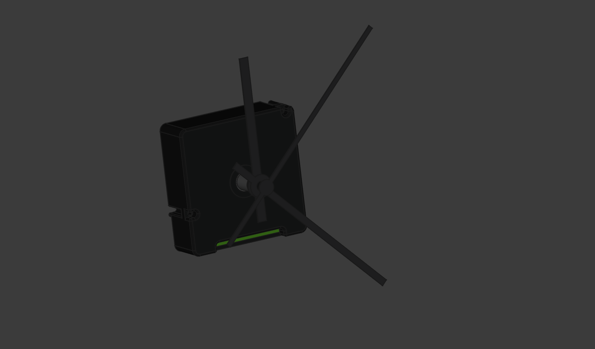

# TFA Dostmann Clock Module (60.3518.01) 3D Model

This repository contains a 3D model of the TFA Dostmann radio-controlled clock movement (60.3518.01) created with FreeCAD 1.0.

## Description

The TFA Dostmann 60.3518.01 is an analogue radio-controlled movement with two sets of hands designed for building custom clocks. This 3D model aims to facilitate integration projects by providing accurate measurements and dimensions of the physical device.

## Features of the Original Device

- Radio-controlled clock with highest precision
- Manual setting option
- Two different sets of hands
- Axial length of 17 mm
- Suitable for dials with maximum 6 mm thickness
- Dimensions: 56 × 37 × 56 mm
- Weight: 78 g
- Power: 1 × AA 1.5V battery (not included)

## Files in this Repository

- [TFA_Dostmann_60_3518_01.FCStd](TFA_Dostmann_60_3518_01.FCStd) - Main FreeCAD 3D model file
- [TFA_Dostmann_60_3518_01.step](TFA_Dostmann_60_3518_01.step) - STEP file for CAD interoperability
- [dimensions.csv](dimensions.csv) - Detailed measurements of the device

## Usage

This 3D model is intended for:

- Integration projects where you need to design enclosures or mounts for the clock module
- Reference purposes for DIY clock projects
- Educational purposes to understand the dimensions and physical characteristics of the device

## Important Note

This 3D model was created through measurements of the physical device and is provided for integration purposes only. The intellectual property rights, design, and right to sell or modify the original device belongs exclusively to TFA Dostmann.

## License

This 3D modeling work is licensed under the [Creative Commons Attribution-NonCommercial-ShareAlike 4.0 International License (CC BY-NC-SA 4.0)](LICENSE).

## Non-Affiliation Statement

This 3D modeling work is not affiliated with, endorsed by, or in any way officially connected with TFA Dostmann. The 3D model is provided as an independent interoperability work and makes no claim to represent official TFA Dostmann products or documentation.

## Original Product Information

For more information about the original product, please visit the [TFA Dostmann website](https://www.tfa-dostmann.de/en/product/analogue-radio-controlled-movement-with-two-sets-of-hands-60-3518/).
