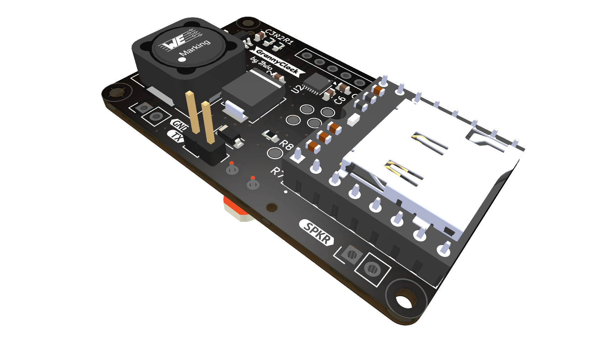

# GrannyClock PCB (v1.0)

## Overview

The GrannyClock PCB is an add-on module designed for the TFA Dostmann 60.3518.01 radio-controlled clock mechanism. It provides enhanced audio capabilities to create a talking/chiming clock while preserving battery life and the original clock functionality.

This PCB interfaces with the TFA clock module signal pins (MU, BR, BA, RF) to detect the current time and play appropriate audio files from an SD card through an integrated DFPlayer Mini MP3 module.

## Specifications

- **Dimensions**: 50x30mm, 2mm rounded corners, 2mm⌀ mounting holes
- **Power Supply**: 2xAA batteries with MT3608 step-up converter (2.0-3.0V to 3.3V)
- **Microcontroller**: ATtiny1616 (VQFN-20 package)
- **Audio**: DFPlayer Mini module with speaker outputs
- **Logic Level Translation**: MAX14611ETD+ bidirectional level shifter (1.5V ↔ 3.3V)
- **Interfaces**:
  - UPDI programming interface
  - Speaker connector
  - Clock module interface connector
  - Test points for debugging

👉 [Schematics](output/schematics/ClockV1.pdf)

## Key Features

- **Power Efficient Design**:

  - Step-up from 2×AA batteries
  - Power switching for the DFPlayer Mini
  - Low-power ATtiny1616
  - Low-power MAX14611 level shifter

- **Intelligent Operation**:

  - Monitors clock signals to determine the current time
  - Plays appropriate audio based on hour information (BCD encoded on MU line)
  - Light sensor for night-time muting

- **Debugging**:
  - Red and green LEDs
  - 7 testing points

## PCB Design Files

This repository contains all necessary KiCad files for the GrannyClock PCB:

- `ClockV1.kicad_sch` - Schematic capture file
- `ClockV1.kicad_pcb` - PCB layout file
- `ClockV1.kicad_pro` - KiCad project file
- `output/` - Generated output files (3D renders, PDFs)
- `production/` - Manufacturing files (gerbers, BOM, position files)

## Design Considerations

### Level Translation

The TFA clock module operates at 1.5V logic levels (single AA power cell), while the microcontroller uses 3.3V. A MAX14611ETD+ level translator chip provides reliable communication between these voltage domains. This component was chosen after testing revealed that traditional MOSFET-based level shifters were unreliable at 1.5V.

### Audio Playback Solution

The DFPlayer Mini module was selected for audio playback capabilities due to:

- Integrated MP3 decoder and amplifier
- Simple serial interface
- SD card file management
- Proven reliability

Power to this module is completely cut when not in use to maximize battery life, as it only needs to be active approximately 16 times per day for brief periods.

### Light Sensing

An onboard photoresistor allows the clock to detect ambient light levels and mute audio output during nighttime or in dark rooms, preventing disturbances during sleep.

## Manufacturing

The PCB is designed for manufacture through JLCPCB with SMT assembly. Key production files are located in the `production/` directory:

- `bom.csv` - Bill of Materials
- `positions.csv` - Component placement data
- `GrannyClock_1.0.zip` - Complete manufacturing package

Notes on component sourcing:

- The DFPlayer Mini module is not SMT assembled and must be manually soldered
- The photoresistor (LDR) needs manual installation
- The MAX14611ETD+ level shifter may require special sourcing if not available in the standard JLCPCB parts library

## Programming

The ATtiny1616 is programmed via the UPDI interface. Compatible programmers include:

- Microchip MPLAB Snap
- PICkit 4
- Any UPDI-compatible programmer
- Simple USB-TTL UART interface

## Integration with TFA Clock

This PCB interfaces with the TFA Dostmann 60.3518.01 clock module via a dedicated connector (J3), which connects to the following signal lines:

- **MU**: BCD-encoded hour value triggered at each hour
- **BA**: "Bell Activate" signal triggered at each hour
- **BR**: Reset signal sent during time adjustments
- **RF**: Demodulated DCF77 time signal
- **PON**: Signal indicating clock module is operational
- **GND**: Common ground

## Related Project Components

The GrannyClock is part of a larger project that includes:

- **Sniffer**: ESP32-based signal analysis tool used to reverse-engineer the TFA clock module
- **Firmware**: ATtiny1616 firmware (coming soon)
- **CAD**: 3D-printed case designs (coming soon)
- **Audio Files**: MP3 samples for the hourly announcements

## License

This hardware design is licensed under the [CERN Open Hardware License v2 - Permissive (CERN-OHL-P)](LICENSE).
