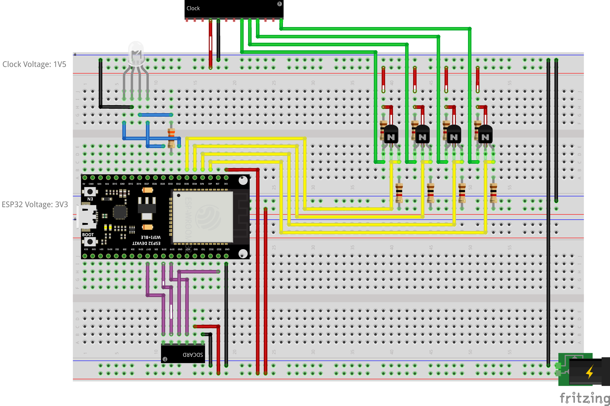

# Clock Signal Sniffer

A hardware and software solution for capturing and analyzing the signal protocol of radio-controlled clock modules. This project specifically focuses on the **TFA Dostmann 60.3518.01** module that uses DCF77 to maintain time synchronization.

## Project Overview

The Sniffer consists of:

1. **Hardware**: ESP32-based sniffer device with digital inputs connected to the clock module signals
2. **Firmware**: Real-time signal capture and logging system
3. **Analysis Tools**: Python scripts for data analysis and protocol decoding
4. **Results**: Discovered timing protocols and signal encoding details

## Hardware Setup

The Clock Sniffer uses an ESP32 microcontroller to monitor digital signals from the TFA Dostmann clock module:

### Connections

| Signal | Description            | ESP32 Pin |
| ------ | ---------------------- | --------- |
| RF     | Radio Frequency signal | GPIO 36   |
| MU     | Minute Unit signal     | GPIO 39   |
| PON    | Power ON signal        | GPIO 34   |
| BA     | BA signal              | GPIO 35   |

### SD Card Connections

| SD Card Pin | ESP32 Pin |
| ----------- | --------- |
| CS          | GPIO 17   |
| MOSI        | GPIO 23   |
| CLK         | GPIO 18   |
| MISO        | GPIO 19   |

### Status LED

| LED Pin | ESP32 Pin |
| ------- | --------- |
| Red     | GPIO 32   |
| Green   | GPIO 33   |
| Blue    | GPIO 25   |

### Circuit Diagram

See the Fritzing diagram in the `circuit` folder: [Fritzing Source File](circuit/Sniffer.fzz).



### Voltage Level Adaptation

The clock module operates at a lower voltage level (1.5V) than the ESP32 (3.3V), which creates a challenge for signal level conversion:

- **Voltage Threshold Issue**: ESP32 GPIO inputs have a TTL minimum high level voltage of 2.0V, while the clock signals peak at only 1.5V.

- **MOSFET Limitations**: Many MOSFETs require at least 2.0V on $V_{th}$ (threshold source-grid) to switch properly, making them unsuitable for this application.

- **Recommended Approach**: The latest version of this project uses a **LM339N comparator** with a 1.0V reference voltage to reliably detect the clock's 1.5V signals.

- **Alternative Components**: Other level shifters could be used but many suitable options (like the MX14611) are not widely available.

#### Important Operation Note

When the clock module is not powered:

- The inputs of the LM339N become unstabilized
- This can generate numerous false edges on the ESP32 inputs
- In extreme cases, this may trigger an "Emergency buffer flush" as the buffer fills with noise

**Recommendation**: Do not leave the ESP32 recording for extended periods when the clock module is unpowered. While this situation is electrically safe, it will create data files filled with meaningless signal transitions.

## Firmware Features

The firmware is built around efficient event capturing and reliable storage:

- **Real-time Signal Monitoring:**

  - Captures both rising and falling edges of all signals
  - Uses interrupts for precise timing measurements
  - Records timestamps using ESP32's `millis()` function

- **Signal Monitoring:**

  - All signals (RF, MU, PON, and BA) are continuously monitored
  - Records both rising and falling edges for all inputs

- **Memory-Efficient Data Buffering:**

  - Thread-safe ring buffer for storing events
  - Buffer capacity of 4096 events (>2.5 hours of data)
  - Each event occupies 8 bytes (signal type, edge type, timestamp)

- **Reliable Data Storage:**

  - Data stored on SD card in CSV format
  - Periodic data flushing (every minute)
  - Resilient to SD card insertion/removal
  - Automatic header creation for new files

- **Visual Status Feedback:**
  - GREEN: System OK, all data committed
  - PURPLE: SD card missing, data pending
  - RED: Buffer overflow, logging stopped
  - Blinking RED: System panic (fatal error)

## Project Structure

```plaintext
Sniffer/
├── circuit/                 # Hardware schematics
│   ├── Sniffer_bb.png       # Breadboard layout
│   └── Sniffer.fzz          # Fritzing source file
├── include/                 # C++ header files
│   ├── Config.h             # Pin definitions and constants
│   └── ...                  # Other headers
├── src/                     # C++ source files
│   ├── main.cpp             # Entry point and main loop
│   ├── RingBuffer.cpp       # Buffer implementation
│   ├── SDCardManager.cpp    # SD card operations
│   ├── SignalLogger.cpp     # Signal capturing
│   └── StatusIndicator.cpp  # LED status display
├── scripts/                 # Analysis scripts
│   ├── Analysis.ipynb       # Jupyter notebook for data analysis
│   └── csv2vcd.py           # Converter for signal visualization
├── platformio.ini           # PlatformIO configuration
└── SPECS.md                 # Project specifications
```

## Analysis Tools and Results

### Python-Based Analysis

The project includes Python scripts for analyzing the captured signals:

- **csv2vcd.py**: Converts CSV log files to Value Change Dump (VCD) format for visualization in tools like [GTKWave][gtkwave] or [PulseView][sigrok]
- **Analysis.ipynb**: Jupyter notebook with signal analysis and protocol decoding

### Protocol Discovery

The analysis revealed the following about the [TFA Dostmann 60.3518.01][tfa] clock module's signal protocol:

1. Communication occurs through the BA and MU signals
2. When BA goes high, MU transmits an encoded time value
3. The encoding follows this pattern:

   ```plaintext
   0b1TTUUUU
   ```

   Where:

   - TT: tens digit (0, 1, 2)
   - UUUU: units digit (0-9)

4. Complete protocol timing:
   - BA goes high
   - 4ms later, MU pulses its encoding:
     - 8ms high pulse (first bit)
     - 6 bits encoding the time (TT and UUUU), each 8ms
     - 4ms high pulse to end the frame
   - Both MU and BA fall at the same time
   - The entire frame lasts 64ms

### Examples of Decoded Time Values

| Time  | Binary Code |
| ----- | ----------- |
| 01:00 | 0b1000001   |
| 03:00 | 0b1000011   |
| 10:00 | 0b1010000   |
| 13:00 | 0b1010011   |
| 23:00 | 0b1100011   |

## Building and Using

1. **Build the firmware:**

   - Clone this repository
   - Open in PlatformIO
   - Configure any settings if needed
   - Build and upload to ESP32

2. **Collecting data:**

   - Connect the ESP32 to the clock module according to the pin definitions
   - Insert an SD card (formatted as FAT32)
   - Power up the system
   - Let it run for the desired duration
   - Remove SD card to access the data files

3. **Analyzing data:**
   - Copy the CSV files to the `_data` directory
   - Convert to VCD format using `csv2vcd.py`
   - Run the Jupyter notebook `Analysis.ipynb` to process the data

## Important Disclaimer

**REGARDING TFA DOSTMANN CLOCK MODULE:**

This project involves connecting external hardware to the TFA Dostmann 60.3518.01 clock module, which is sold by TFA Dostmann exclusively as an internal component for integration. Please be aware that:

1. Any modification or connection of electronic components to this clock module is performed entirely at your own risk.
2. Such modifications may void any warranty or guarantee provided by TFA Dostmann.
3. TFA Dostmann is not associated with this project and bears no responsibility for any issues arising from the use of this code or hardware designs.

**PROTOCOL USAGE:**

The signal protocol documented in this project was discovered through reverse engineering for interoperability purposes. While sharing this knowledge is believed to be legal in many jurisdictions, the implementation of this protocol in commercial products may be subject to patents or other intellectual property restrictions. Users should perform their own legal due diligence before commercial implementation.

## Future Improvements

- Add RTC for absolute timestamps
- Implement wireless data transmission
- Create a web interface for real-time monitoring
- Expand the analysis to other clock modules and protocols

## License

This project is licensed under the MIT License - see the [LICENSE](LICENSE) file for details.

The MIT License applies only to the software, documentation, and circuit designs in this repository. It does not extend to any proprietary hardware, protocols, or other intellectual property owned by third parties including TFA Dostmann.

[gtkwave]: https://gtkwave.sourceforge.net/
[sigrok]: https://sigrok.org/download/
[tfa]: https://www.tfa-dostmann.de/en/product/analogue-radio-controlled-movement-with-two-sets-of-hands-60-3518/
