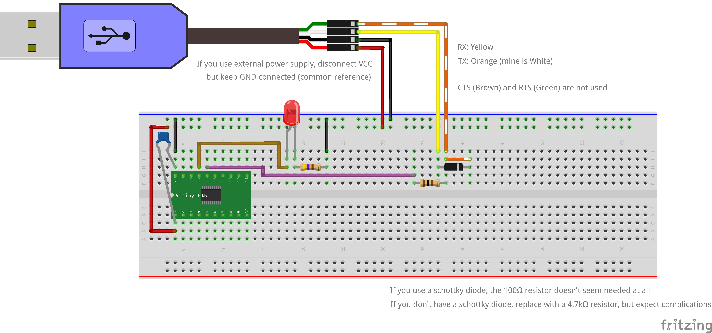

# ATtiny1616 Boilerplate

A basic PlatformIO project template for ATtiny1616 development with UPDI programming.



## Overview

This project provides a simple, ready-to-use boilerplate for ATtiny1616 development using:

- PlatformIO as the development platform
- Arduino framework for simplified coding
- UPDI programming via a standard USB-TTL adapter
- Automatic installation of required programming tools

The included code demonstrates basic LED blinking on pin PA1 (physical pin 17) of the ATtiny1616.

## Hardware Requirements

- ATtiny1616 microcontroller
- USB-TTL adapter (FTDI, CP2102, CH340, etc.)
- Schottky diode (1N5819 recommended)
- 100nF capacitor
- 470Ω resistor
- Red LED
- Breadboard and jumper wires

## Circuit Connection

### UPDI Programming Connection

The ATtiny1616 is programmed using the UPDI interface, which requires a specific connection method to enable bidirectional communication on a shared line:

1. Connect GND from the USB-TTL adapter to GND on the ATtiny1616
2. Connect 5V (or 3.3V) from the USB-TTL adapter to VCC on the ATtiny1616
3. Connect TX from USB-TTL adapter to the ATtiny1616's UPDI pin (pin 18) via direct connection
4. Connect RX from the USB-TTL adapter to the TX-UPDI connection via a Schottky diode (cathode toward TX)

**Important Notes About UPDI Connection:**

- A Schottky diode (1N5819) is **strongly recommended** between RX and the TX-UPDI connection
- The Schottky diode ensures proper bidirectional communication while preventing signal conflicts
- Although some documentation suggests using a 4.7kΩ resistor instead of the diode with a 470Ω-1kΩ resistor between TX and UPDI, this configuration has proven less reliable

### Why the Schottky Diode Works Better Than Resistors

The UPDI protocol requires bidirectional communication on a single line. The challenge is:

1. When the ATtiny pulls the UPDI line low, the RX pin must be able to read this low level
2. When the programmer (TX) pulls the line low, the ATtiny must recognize this as a low level

With resistors, balancing the voltage divider to work in both directions can be challenging. The Schottky diode provides a simpler solution:

- Allows current to flow from the TX-UPDI connection to RX when the ATtiny pulls the line low
- Prevents back current to RX when TX is driving the line
- Has minimal voltage drop (0.2-0.3V) ensuring signal integrity

## Software Setup

1. Clone this repository
2. Open the project in PlatformIO
3. Connect your USB-TTL adapter to your computer
4. Build and upload the project

The `pymcuprog` tool required for programming will be automatically installed in PlatformIO's virtual environment if it's not already present.

## Project Structure

```plaintext
ATtiny1616Boilerplate/
│
├── circuit/                  # Circuit diagrams and Fritzing files
│   ├── ATtiny1616Boilerplate_bb.png  # Breadboard view
│   ├── ATtiny1616Boilerplate_sch.png # Schematic view
│   └── ATtiny1616Boilerplate.fzz     # Fritzing source
│
├── scripts/
│   └── requirements.py       # Script to install required dependencies
│
├── src/
│   └── main.cpp              # Main program source code
│
├── platformio.ini            # PlatformIO configuration
└── README.md                 # This file
```

## PlatformIO Configuration

The project is configured to use:

- Framework: Arduino
- Platform: atmelmegaavr
- Board: ATtiny1616
- Upload method: UPDI via pymcuprog

## Additional Resources

- [ATtiny1616 Datasheet](https://ww1.microchip.com/downloads/en/DeviceDoc/ATtiny1614-16-17-DataSheet-DS40002204A.pdf)
- [PlatformIO Documentation](https://docs.platformio.org/en/latest/boards/atmelmegaavr/ATtiny1616.html)
- [Complete Schematic](circuit/ATtiny1616Boilerplate_sch.png)

## License

This project is licensed under the [MIT License](LICENSE).
