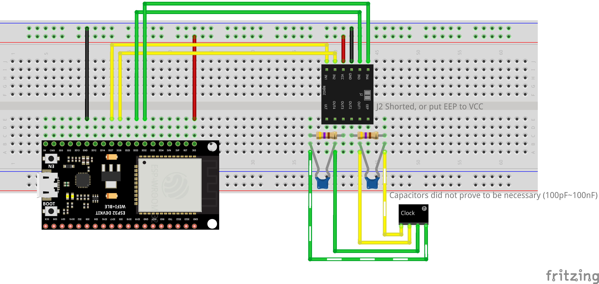

# DRV8833 Solenoid Driver Testing

This project contains testing software designed to test the DRV8833 module (a module based on the DRV8833 chipset) for controlling solenoids in a clock mechanism.

## Overview

The original clock mechanism uses solenoids to drive the seconds and minutes hands. This test program simulates the driving signals to verify proper operation and find optimal parameters for reliable operation.

- The seconds hand solenoid advances the hand by one second per pulse
- The minutes hand solenoid requires 6 pulses to advance by one minute
- The hours hand is driven mechanically by a gear system connected to the minutes hand

## Hardware Setup

### Connections

- **Second Hand Solenoid**:

  - Connected to DRV8833 outputs controlled by IN1/IN2
  - ESP32 GPIO 27 → DRV8833 IN1
  - ESP32 GPIO 26 → DRV8833 IN2

- **Minute Hand Solenoid**:
  - Connected to DRV8833 outputs controlled by IN3/IN4
  - ESP32 GPIO 33 → DRV8833 IN3
  - ESP32 GPIO 32 → DRV8833 IN4

### Resistor Configuration

A 470 ohm resistor should be placed in series with each solenoid. This is critical because:

- The original solenoids are designed for 1.2V-1.5V (single AA battery with losses)
- Direct connection to 3.3V can cause:
  - Too much current flow
  - Violent gear movement
  - Oscillation issues
  - Improper engagement

## Experimental Findings

Extensive testing with different pulse widths and resistor values revealed the following:

| Pulse Width | Behavior Without Resistor                                     | Behavior With 470Ω Resistor                                  |
| ----------- | ------------------------------------------------------------- | ------------------------------------------------------------ |
| < 20ms      | Current doesn't have time to flow properly, gear doesn't move | Same issue,                                                  |
| 20-30ms     | Inconsistent movement                                         | Inconsistent movements                                       |
| 40ms        | Gear is shaken but doesn't rotate                             | **Optimal performance** - clean movement like original clock |
| 50-60ms     | No moves                                                      | Starts to oscillates                                         |
| > 60ms      | No moves                                                      | Violent repulsion followed by oscillation, noisy             |

**Optimal Configuration**: 40ms pulse width with 470 ohm resistor in series with each solenoid.

_Note:_ The original design includes a capacitor in parallel with the solenoid, but any range from 100pF to 100nF did not have any noticeable impact on either the movement nor the observed wave.

## Software

The program alternates pulses between IN1/IN2 for the seconds solenoid and IN3/IN4 for the minutes solenoid:

- Each second, a pulse is sent to one of the control pins
- Pulse width is configurable (set to 40ms by default)
- Control pins are alternated to create bidirectional magnetic field

Configuration parameters are stored in `include/Config.h`, including:

- Pin definitions for both solenoids
- Pulse width timing (40ms)

## Future Development

This is only a testing program. The final implementation will:

- Integrate with actual timekeeping
- Include power management
- Add features for alarm and time setting

## License

MIT License

Copyright (c) 2025 Tehoor Marjan

See the [LICENSE](LICENSE) file for full details.
