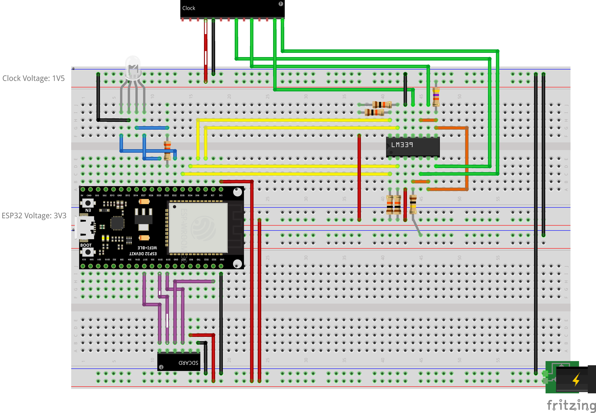

# GrannyClock Testing Projects

This directory contains various testing and prototyping projects that were developed as part of the GrannyClock project. Each subdirectory represents a specific module or component that required testing, debugging, or reverse-engineering during the development process.

These mini-projects were essential for solving critical technical challenges and validating different approaches before integration into the final GrannyClock firmware and hardware design.

1. **Prototyping:** Rapidly testing ideas and approaches before committing to the final design
2. **Validation:** Verifying that components work as expected in isolation
3. **Reverse Engineering:** Understanding proprietary protocols and interfaces
4. **Parameter Tuning:** Finding optimal settings for mechanical and electrical components
5. **Integration Preparation:** Ensuring components will work together before final assembly

## Project Overview

| Project                                         | Description                                      | Technologies                    |
| ----------------------------------------------- | ------------------------------------------------ | ------------------------------- |
| [ATtiny1616Boilerplate](#attiny1616boilerplate) | Test project for programming ATtiny1616 via UPDI | ATtiny1616, UPDI                |
| [DRV8833DFPlayer](#drv8833dfplayer)             | Solenoid driver testing for clock mechanism      | DRV8833, ESP32, Solenoids       |
| [Sniffer](#sniffer)                             | Protocol analyzer for TFA Dostmann clock modules | ESP32, Signal Analysis, HD-1866 |
| [PyGrannyTool](#pygrannytool)                   | Collection of testing tools                      | Python, Neo-6M                  |

## ATtiny1616Boilerplate

A basic project template for ATtiny1616 development using UPDI programming with a standard USB-TTL adapter.

**Key Features:**

- Ready-to-use PlatformIO configuration for ATtiny1616
- UPDI programming using standard USB-TTL adapter with Schottky diode
- Auto-installation of required programming tools
- Simple LED blink example

[Full Documentation →](ATtiny1616Boilerplate/README.md)

## DRV8833DFPlayer

Test project for driving solenoids in the mechanical clock mechanism using a DRV8833 motor driver module.

**Key Features:**

- Precise control of solenoids for seconds and minutes hands
- Pulse width experimentation for optimal mechanical operation
- Configuration for proper current limiting with 470Ω resistors
- ESP32-based testing platform

[Full Documentation →](DRV8833DFPlayer/README.md)

## Sniffer

A hardware and software solution for capturing and analyzing the signal protocol of radio-controlled clock modules, specifically for the TFA Dostmann 60.3518.01.

**Key Features:**

- ESP32-based signal capture system with SD card logging
- Level shifting for 1.5V clock signals using LM339N comparators
- Real-time monitoring of multiple clock module signals
- Python-based analysis tools for decoding captured data

[Full Documentation →](Sniffer/README.md)

## PyGrannyTool

A testing tool written in Python to do different tests and prototypings while advancing in the project.

**Key Features:**

- Test retrieving time and date from Neo-6M module using USB serial
- 🚧 More to come

[Full Documentation →](Sniffer/README.md)
