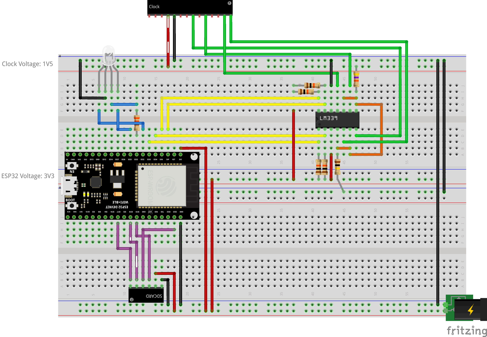

# Sniffer Requirements

## Goal

This program runs on an ESP32. Its goal is to log digital signals comming from
different sources from a clock module and for each edge (rising/falling),
log the `millis` timestamp. The logging is buffered in the memory and is
committed to a file on the SD Card.

## Modules

- ESP32: (See connections below)
- Clock:
  - RF: _IN_ ESP32-GPIO36 (DCF77 signal)
  - MU: _IN_ ESP32-GPIO39 (MUsic signal)
  - PON: _IN_ ESP32-GPIO34 (Power ON signal)
  - BA: _IN_ ESP32-GPIO35 (BA signal)
- SD Card reader:
  - CS: _OUT_ ESP32-GPIO17
  - MOSI: _OUT_ ESP32-GPIO23
  - CLK: _OUT_ ESP32-GPIO18
  - MISO: _IN_ ESP32-GPIO19
- RGB LED:
  - Red: _OUT_ ESP32-GPIO32
  - Green: _OUT_ ESP32-GPIO33
  - Blue: _OUT_ ESP32-GPIO25

## Breadboard



## Requirements

- RF, MU, PON, BA shall trigger logging at each rising edge (0->1) and falling edge (1->0).
- RF, MU, PON, BA logging shall be active all the time
- Logging shall happen into a ring buffer with writing and reading head
- Each logging entry shall contain:
  - Triggering signal (RF/MU/PON/BA)
  - Rising or Falling event
  - The value of `millis()` when event happened (or at latest when event is treated)
- SD Card might be inserted/removed during operation (to collect data). This shall not impact logging to memory
- Every so often, content of memory shall be offloaded to SD Card:
  - Attempted every minute
  - Aborted if ring buffer is empty (no data since last commit, reading head = writing head)
  - Aborted if SD Card is not present
  - Append data to the logging file
  - Advance the reading head
- Logging format is CSV with one event per line
  - Columns are: Triggering signal (two letters), R or F (rising falling), Timestamp in millis (decimal)
  - If file is empty, create a header line "Signal,Edge,Timestamp"
- Signal logging interrupts are higher priorities than writing to SD Card
  - It shall be possible to log all triggering signals, even if they happen at the same time or close together
  - If necessary, use a queue and protect the ring buffer write operation with a mutex

## Implementation Approach

1. **Setup Hardware Configuration**

   - Configure GPIO pins for the clock signals (RF, MU, BR, BA)
   - Configure SPI interface for the SD card reader
   - Set up input pins with appropriate pull-up/pull-down resistors
   - Configure RGB LED for status indication

2. **Implement Ring Buffer**

   - Design a thread-safe ring buffer structure to store signal events
   - Include fields for signal type, edge type, and timestamp
   - Implement write and read pointers for managing the buffer
   - Add mutex protection for concurrent access
   - Overflow protection: if writing head reaches reading head, reject new writes
   - Size buffer to accommodate at least 2h30 of logging (32KB)

3. **Implement Interrupt Handlers**

   - Set up interrupt service routines for all input pins
   - Configure for both RISING and FALLING edge detection
   - Record signal type, edge direction, and timestamp in each interrupt
   - Use the mutex-protected ring buffer to store events

4. **Signal Logging**

   - Set up interrupt handlers for all signals (RF, MU, PON, BA)
   - Ensure all signals are logged continuously without special timing windows

5. **SD Card Data Management**

   - Create functions to initialize the SD card and check its presence
   - Implement a periodic task (every minute) to flush data to the SD card
   - Implement CSV file creation with appropriate headers when needed
   - Handle appending new data to existing files

6. **Main Loop Structure**

   - Initialize all hardware components
   - Set up interrupt handlers
   - Implement the main loop with timing for SD card writes
   - Manage RGB LED status indication

7. **Error Handling and Status Indication**
   - RGB LED status indicators:
     - GREEN: Status good, all data committed
     - PURPLE (RED+BLUE): New data to commit, but SD Card not found
     - RED: Logging stopped due to buffer overflow
     - Blinking RED: Program panic (fatal error)
   - Handle SD card insertion/removal gracefully

## Data Flow Calculations

- RF: 1 pulse (2 events) per second max when active = up to 7200 events/hour when continuously active
- MU: 2-8 events every 15 minutes = ~40 events/hour
- PON and BA: Maximum of 40 events each per 15 minutes = ~160 events/hour each
- Total: Up to ~7560 events/hour during peak activity

Memory requirements:

- Each log entry: ~8 bytes (4 bytes timestamp, 1 byte signal, 1 byte edge type, 2 bytes padding)
- 32KB of RAM = 4096 events = >2h30 of continuous logging capacity

## File Hierarchy

1. **src/main.cpp**

   - Main application entry point
   - Setup and loop functions
   - Global timing and state management

2. **include/RingBuffer.h & src/RingBuffer.cpp**

   - Thread-safe ring buffer implementation
   - Event storage structure
   - Mutex-protected access methods

3. **include/SignalLogger.h & src/SignalLogger.cpp**

   - Signal detection and interrupt handling
   - Interrupt Service Routine registration
   - Continuous monitoring of all signals

4. **include/SDCardManager.h & src/SDCardManager.cpp**

   - SD card initialization and check
   - File creation and appending
   - Data flushing from ring buffer to SD card

5. **include/StatusIndicator.h & src/StatusIndicator.cpp**

   - RGB LED control
   - Status codes and display patterns
   - Visual feedback management

6. **include/Config.h**
   - Pin definitions
   - Timing constants
   - Buffer sizes and other configuration parameters
   - Common types and data structures

The core data structure for this project:

```cpp
struct EventEntry {
  uint8_t signalType;  // RF, MU, PON, BA
  uint8_t edgeType;    // RISING or FALLING
  uint16_t reserved;   // Later use and alignment
  uint32_t timestamp;  // millis() value
};

```
